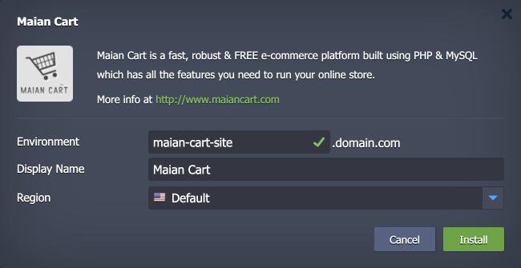

 

# Maian Cart

The package deploys the [Maian Cart](https://www.maiancart.com/) solution - a solid self-hosted platform to sell your products. Maian Cart is a comprehensive e-commerce solution designed to help businesses create and manage online stores with ease. It offers a wide range of features including product management, order processing, customer management, and various payment gateway integrations.

## Environment Topology

This package creates a dedicated Maian Cart environment that contains one application server and one database container. It automatically deploys and sets the Maian Cart application. The automatic vertical scaling is enabled out of the box, and [horizontal scaling](https://www.virtuozzo.com/application-platform-docs/automatic-horizontal-scaling/) can be configured (if needed). The default software stacks utilized in the package are the following:

- Apache 2 PHP application server (PHP 8.1)
- MariaDB 10 database
- Maian Cart 3.8

## Deployment to Cloud

To get your Maian Cart solution, click the "**Deploy to Cloud**" button below, specify your email address within the widget, choose one of the [Virtuozzo Public Cloud Providers](https://www.virtuozzo.com/application-platform-partners/), and confirm by clicking **Install**.

> If you already have a Virtuozzo Application Platform (VAP) account, you can deploy this solution from the [Marketplace](https://www.virtuozzo.com/application-platform-docs/marketplace/) or [import](https://www.virtuozzo.com/application-platform-docs/environment-import/) a manifest file from this repository.

## Installation Process

In the opened installation window at the VAP dashboard, provide a preferred environment and display names, choose a region (if available), and confirm the installation.

Your Maian Cart application will be automatically installed in a few minutes.
